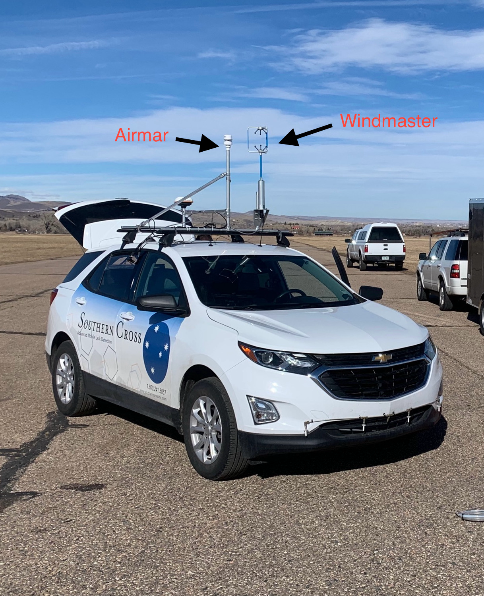

```{r setup, include=FALSE}
knitr::opts_chunk$set(echo = FALSE,message=F,warning=F)
library(readr)
library(ggplot2)
library(dplyr)
options(digits = 20)
knitr::opts_chunk$set(fig.align = 'center', out.extra = "")
knitr::opts_chunk$set(out.height = '70%',out.width = '70%')
knitr::opts_chunk$set(fig.pos='H',fig.cap=" ")
```

```{r,echo=F,message=F,warning=F}
#stationaryData <- FinalAggregated_210202_121448 <- #read_csv("~/Documents/GitHub/ugh/020221/archive_210202_121448/FinalAggregated_210202_121448.csv")
#bothDataStationary <- read_csv("data/appended_210202_121448")

#togetherStat <- together
#togetherDrive <- together
# bothTogether <- plyr::join(togetherStat %>% mutate(type='stationary'),
#                            togetherDrive %>% mutate(type='driving'),
#                            type='full') %>%
#   group_by(nearest10hz) %>%
#   mutate(EW5 = as.numeric(EW5),NS5 = as.numeric(NS5),Z5 = as.numeric(Z5),
#          sideSideAirmar =as.numeric(avg_windSpeed)*sin(as.numeric(avg_windAngle)),
#          frontBackAirmar = -avg_windSpeed*cos(avg_windAngle)
#          ) %>%
#   mutate(airmar_ws = sqrt(frontBackAirmar^2+sideSideAirmar^2),
#          airmar_wd = atan2(frontBackAirmar,sideSideAirmar),
#          windmaster_ws = sqrt(EW5^2 + Z5^2),
#          windmaster_wd = atan2(Z5,EW5)) %>%
#   ungroup() %>%
#   rename('frontBackWindmaster' = Z5) %>%
#   rename('sideSideWindmaster' = EW5)
# 
# write_csv(bothTogether,'data/feb2_comparison.csv')
bothTogether <- read_csv('data/feb2_comparison.csv')
drivingDat <- bothTogether %>% 
  dplyr::filter(type=='driving') 
parkedDat <- bothTogether %>% 
  dplyr::filter(type!='driving')
```

```{r,echo=F,message=F,warning=F}
bothTogetherGathered <- bothTogether %>% 
  tidyr::gather(key='WhichWindSpeed',value='WindSpeed',c(52,54)) %>% 
  tidyr::gather(key='WhichWindAngle',value='WindDirection',c(windmaster_wd,airmar_wd)) %>% 
  #rename('frontBackWindmaster' = Z5) %>% 
  #rename('sideSideWindmaster' = EW5) %>% 
  tidyr::gather(key='whichFrontBack',value='FrontBackSpeed',c(frontBackAirmar,frontBackWindmaster)) %>%
    tidyr::gather(key='whichSideSide',value='sideSideSpeed',c(sideSideAirmar,sideSideWindmaster)) 

```

# Test Overview
In these two tests, the airmar (current anemometer for the vehicle), and the windmaster were positioned on top of the car. In one test, the car was stationary, while in the other, the vehicle moved.

Orientation of the two anemometers:

```{r, echo=FALSE, out.width="50%", fig.cap="Car configuration"}

```

## Test Goals
- Determine alignment/reference frame of each anemometer
- Determine similarity of windspeed and wind angle of stationary comparison
- Determine similarity of windspeed and wind angle of stationary comparison
- Look at relationship between windspeed, vehicle speed, vehicle bearing, etc. on comparisons

### Data Overview

First, we review the location information:
```{r,echo=F,fig.pos='h',fig.align='center',fig.cap='Location of the vehicle at each test'}
bothTogether %>% 
  ggplot(aes(x=Longitude,y=Latitude))+geom_point() + facet_wrap(~type)+
  theme_bw() + ggtitle('Location for Each Test')+theme(axis.text = element_blank())
```

And the Bearing of the car
```{r,echo=F,fig.pos='h',fig.align='center',fig.cap='Location of the vehicle at each test'}
bothTogether %>% 
  dplyr::filter(type=='driving') %>% 
  dplyr::filter(Velocity> 7) %>% 
  mutate(BearingDir = ifelse(Bearing > 4.3, 'Away','Towards')) %>% 
  ggplot(aes(x=Longitude,y=Latitude,col=Velocity))+geom_point() + facet_grid(type~BearingDir)+
  theme_bw() + ggtitle('Location for Each Test')+theme(axis.text = element_blank())
```

### Reference Frames

For each data source, we have

- Airmar: avg_wind_speed
- Airmar: avg_wind_angle

This is raw data from the car (uncorrected). However, we would like to break the data into it's front/back and side/side components

$$\vec{WS}_{A,frontback} = -windSpeed_{avg}\times\cos(windAngle_{avg})$$
$$\vec{WS}_{A,side-side} = windSpeed_{avg}\times \sin(windAngle_{avg})$$

$$WS_{A,total} = \sqrt{\left({\vec{WS}_{A,frontback}}\right)^2 + \left({\vec{WS}_{A,side-side}}\right)^2}$$
If we wanted to back calculate and find the original wind angle (which is what was already provided),

$$\theta_{a} = atan2\left(\vec{WS}_{A,frontback},\vec{WS}_{A,side-side}\right)$$


Then,the windmaster array has many inputs. Depending on the configuration (which we should document), the different inputs correspond to different directions.

However, in this test, we have

$$\vec{WS}_{W,frontback} = Z_5$$
$$\vec{WS}_{W,side-side} = EW_5$$

Where $Z_5$ corresponds to $U_x(5)$, and $EW_5$ corresponds to $U_y(5)$ from the input. 

Again, we find 

$$WS_{W,total} = \sqrt{\left({\vec{WS}_{W,frontback}}\right)^2 + \left({\vec{WS}_{W,side-side}}\right)^2}$$

Lastly, we can calculate the overall wind angle by:

$$\theta_{wm} = atan2\left(\vec{WS}_{W,frontback},\vec{WS}_{W,side-side}\right)$$

### Demonstrating understanding of the frame of reference
Supposing that our reference is correct, we should find that:

- the overall wind speeds of both align
- when driving, the front/back wind speed should be dominant
- when driving, the wind direction should be dominant for the front of the car

#### Overall Wind Speed Comparison:

Investigating the effect of the windmaster's 3 dimensional data input:

```{r}
plot(y=sqrt(bothTogether$frontBackWindmaster^2 + bothTogether$sideSideWindmaster^2 + bothTogether$NS5^2) - sqrt(bothTogether$frontBackWindmaster^2 + bothTogether$sideSideWindmaster^2),x=bothTogether$nearest10hz,ylab='WS difference (3d - 2d)',xlab='Time',main='Wind Speed, windmaster, from 3d - 2d')
lines(sqrt(bothTogether$frontBackWindmaster^2 + bothTogether$sideSideWindmaster^2),type='l',col='purple')
#lines(bothTogether$airmar_ws,col='red')
legend(col=c('black','red'),legend = c('Windmaster all comp','Airmar'),x=0,y=12,pch=c(20,20))
```

```{r}
plot(y=sqrt(bothTogether$frontBackWindmaster^2 + bothTogether$sideSideWindmaster^2 + bothTogether$NS5^2) ,x=bothTogether$nearest10hz,ylab='WS difference (3d - 2d)',xlab='Time',main='Wind Speed, windmaster, from 3d and 2d',type='l')
lines(y=sqrt(bothTogether$frontBackWindmaster^2 + bothTogether$sideSideWindmaster^2),x=bothTogether$nearest10hz,type='l',col='purple')
#lines(bothTogether$airmar_ws,col='red')
legend(col=c('black','purple'),legend = c('Windmaster 3d ','Windmaster 2d'),x=min(bothTogether$nearest10hz),y=12,pch=c(20,20))
```

```{r,fig.cap='As car velocity increases, we see the up/down wind speed from the windmaster also increases slightly'}
fit <- lm(NS5 ~ Velocity,data=bothTogether)
fitLine <- paste('b0 = ',round(fit$coefficients[1],2),' \n b1= ',
                 round(fit$coefficients[2],2),sep='')
plot(y=bothTogether$NS5 ,x=bothTogether$Velocity,ylab='Up/Down WS, windmaster',xlab='Velocity',main='Wind Speed, windmaster, up/down',pch=20)
lines(x=c(0,12),y=c(fit$coefficients[1],fit$coefficients[1]+12*fit$coefficients[2]),col='red')
legend(legend = c('Up-Down WS',fitLine),x=0,
       y=2.5,col=c("black","red"),pch=c(20,20))
```

Check relationship between overall windspeed and velocity
```{r}
bothTogetherGathered %>% 
  dplyr::filter(type=='driving') %>% 
  mutate(BearingDir = ifelse(Bearing > 4.3, 'Away','Towards')) %>% 
  dplyr::filter(Velocity>7.1)  %>% 
  ggplot(aes(y=WindSpeed,x=Velocity))+
  geom_abline(slope=1,intercept=0,col='red')+
  geom_point()+facet_grid(BearingDir~WhichWindSpeed) + theme_bw() + geom_smooth(se=F,method='lm',show.legend=T)
```

```{r}
bothTogetherGathered %>% 
  dplyr::filter(type=='driving') %>% 
  mutate(BearingDir = ifelse(Bearing > 4.3, 'Away','Towards')) %>% 
  dplyr::filter(Velocity>7.1)  %>% 
  ggplot(aes(y=FrontBackSpeed,x=Velocity))+
  geom_abline(slope=-1,intercept=0,col='red')+
  geom_point()+facet_grid(BearingDir~whichFrontBack) + theme_bw() + geom_smooth(se=F,method='lm',show.legend=T)+ylab('Magnitude, FrontBack Wind')+xlab("Car Velocity")
```

```{r,fig.cap='Suggests that Airmar Overall reads in a higher front/back wind reading'}
bothTogether %>% 
  #dplyr::filter(type=='driving') %>% 
  mutate(BearingDir = ifelse(Bearing > 4.3, 'Away','Towards')) %>% 
  dplyr::filter(Velocity>7.1)  %>% 
  ggplot(aes(x=abs(frontBackAirmar),y=abs(frontBackWindmaster)))+
  geom_abline(slope=1,intercept=0,col='red',linetype='dotted')+
  geom_point()+facet_grid(type~BearingDir) + theme_bw() + geom_smooth(se=F,method='lm',show.legend=T)+xlab('FrontBack Airmar')+ylab("Front Back WindMaster") + xlim(c(17,5))+ylim(c(17,5))
```

```{r}
smallerDrivingAway<- bothTogether %>% 
  dplyr::filter(type=='driving') %>% 
  mutate(BearingDir = ifelse(Bearing > 4.3, 'Away','Towards')) %>% 
  dplyr::filter(Velocity>7.1)  %>% 
  dplyr::filter(BearingDir == "Away")

fit <- lm(smallerDrivingAway$frontBackWindmaster~smallerDrivingAway$frontBackAirmar)
fit1 <- lm(smallerDrivingAway$frontBackWindmaster~smallerDrivingAway$frontBackAirmar*smallerDrivingAway$Velocity)


fit3 <- lm(bothTogether$frontBackWindmaster~bothTogether$frontBackAirmar)

fit2_side <- lm(bothTogether$sideSideWindmaster~bothTogether$sideSideAirmar*bothTogether$Velocity)

fit_side <- lm(bothTogether$sideSideWindmaster~bothTogether$sideSideAirmar)

fit3 <- lm(bothTogether$frontBackWindmaster~bothTogether$frontBackAirmar)

fit1 <- lm(smallerDrivingAway$frontBackWindmaster~smallerDrivingAway$frontBackAirmar*smallerDrivingAway$Velocity)

fit2 <- lm(bothTogether$frontBackWindmaster~bothTogether$frontBackAirmar+bothTogether$Velocity)
fit3 <- lm(bothTogether$frontBackWindmaster~bothTogether$frontBackAirmar)


plot(smallerDrivingAway$frontBackAirmar,smallerDrivingAway$frontBackWindmaster)
lines(y=c(fit$coefficients[1]+fit$coefficients[2]*-12,
          fit$coefficients[1]+fit$coefficients[2]*12),
      x= c(-12,12),col='purple')
lines(x=c(-12,12),y=c(-12,12),col='red')

plot(y=smallerDrivingAway$frontBackAirmar-smallerDrivingAway$frontBackWindmaster,x=smallerDrivingAway$Velocity)
lines(y=c(fit$coefficients[1]+fit$coefficients[2]*-12,
          fit$coefficients[1]+fit$coefficients[2]*12),
      x= c(-12,12),col='purple')
lines(x=c(-12,12),y=c(-12,12),col='red')

smallstat <- bothTogether %>% dplyr::filter(type!='driving')
smallerDriving <- bothTogether %>% dplyr::filter(type=='driving')
fit <- lm(smallstat$frontBackWindmaster~smallstat$frontBackAirmar)
fit1 <- lm(smallstat$frontBackWindmaster~smallstat$frontBackAirmar*smallstat$Velocity)

plot(x=smallstat$frontBackAirmar,y=smallstat$frontBackWindmaster,
     xlab='Front-Back WS,Airmar',ylab='Front-Back WS, Windmaster',
     main='Front-Back WS, comparison of Airmar and Windmaster,\n both mounted on vehicle')
lines(y=c(fit$coefficients[1]+fit$coefficients[2]*-12,
          fit$coefficients[1]+fit$coefficients[2]*12),
      x= c(-12,12),col='purple')
lines(x=c(-12,12),y=c(-12,12),col='red',lwd=2)
legend(col=c("purple","red"),legend=c('Fitted','Slope 1'),
       x=1,y=5,pch=c(20,20))
```

```{r,fig.cap='Side to side wind readings of driving comparison of both on vehicle suggest non 1:1 relationship'}
plot(y=drivingDat$sideSideAirmar,x=drivingDat$sideSideWindmaster,
     xlab='Side-side, windmaster',ylab='side-side,airmar',
     main='Side-Side wind speed, airmar & windmaster (car moving)')
lines(y=c(-12,12),x=c(-12,12),col='red')
```

```{r,fig.cap='Side to side wind readings of stationary comparison of both on vehicle suggest more of a 1:1 relationship'}
plot(y=parkedDat$sideSideAirmar,x=parkedDat$sideSideWindmaster,
      xlab='Side-side, windmaster',ylab='side-side,airmar',
     main='Side-Side wind speed, airmar & windmaster (car parked)')
lines(y=c(-12,12),x=c(-12,12),col='red')
```

```{r,fig.cap='Front to Back wind readings of driving comparison of both on vehicle suggest non 1:1 relationship'}

fbFit <- lm(frontBackAirmar ~ frontBackWindmaster,data = drivingDat)
plot(y=drivingDat$frontBackAirmar,x=drivingDat$frontBackWindmaster,
     xlab='Front-Back, windmaster',ylab='Front-Back,airmar',
     main='Front-Back wind speed, airmar & windmaster (car moving)',
     xlim=c(-18,5),ylim=c(-18,5))
lines(y=c(-15,15),x=c(-15,15),col='red')
lines(y=c(fbFit$coefficients[1]+fbFit$coefficients[2]*-15,
          fbFit$coefficients[1]+fbFit$coefficients[2]*15),
      x=c(-15,15),col='purple')
text(x=-15,y=0,paste('Intercept: ',round(fbFit$coefficients[1],2),
                     '\n Slope: ', round(fbFit$coefficients[2],2)),
     col='purple')
```

```{r,fig.cap='Front-Back wind readings of stationary comparison of both on vehicle suggest more of a 1:1 relationship'}
fbFit_park <- lm(frontBackAirmar ~ frontBackWindmaster,data = parkedDat)

plot(y=parkedDat$frontBackAirmar,x=parkedDat$frontBackWindmaster,
     xlab='Front-Back, windmaster',ylab='Front-Back,airmar',
     main='Front-Back wind speed, airmar & windmaster (car parked)',
     xlim=c(0,6),ylim=c(0,6))
lines(y=c(-15,15),x=c(-15,15),col='red')
lines(y=c(fbFit_park$coefficients[1]+fbFit_park$coefficients[2]*-15,
          fbFit_park$coefficients[1]+fbFit_park$coefficients[2]*15),
      x=c(-15,15),col='purple')
text(x=1,y=5,paste('Intercept: ',round(fbFit_park$coefficients[1],2),
                     '\n Slope: ', round(fbFit_park$coefficients[2],2)),
     col='purple')

```

Clearly, we see a relationship where the front-back of the airmar and windmaster differ. However, we see that this relationship also is dependent upon car velocity.

```{r,echo=F,fig.cap='Relationship between Front-Back WS, based on car velocity suggests as velocity increases, the airmar and windmaster differ more.'}
fit_drive <- lm(frontBackAirmar-frontBackWindmaster ~Velocity,data=drivingDat)
plot(y=drivingDat$frontBackAirmar - drivingDat$frontBackWindmaster,
     x=drivingDat$Velocity,xlab='Car Velocity',ylab='Front-Back WS, Airmar - WindMaster',main='Front-Back WS Relationship vs. Velocity,\n car moving, both vehicle-mounted',pch=20)
lines(x=c(0,15),y=c(fit_drive$coefficients[1],fit_drive$coefficients[1] +
                      fit_drive$coefficients[2]*15),col='red',lwd=2)
#legend(legend = c('Raw Data',paste('int: ',round(fit_drive$coefficients[1],2),'\n slope: ',round(fit_drive$coefficients[2],2),sep='')),x=8,y=1,col=c('black','red'),pch=c(20,20))
```

```{r,echo=F,fig.cap='Relationship between Side-Side WS, based on car velocity suggests as velocity increases, the airmar and windmaster differ more.'}
plot(y=drivingDat$sideSideAirmar - drivingDat$sideSideWindmaster,
     x=drivingDat$Velocity)
```

Next, we will fit the following models:

$$ \text{WS}_{W,fb} = \beta_0 + \beta_1 \text{WS}_{A,fb} + \beta_2 \text{Velocity}_{car} + \epsilon$$

$$ \text{WS}_{W,ss} = \beta_0 + \beta_1 \text{WS}_{A,ss} + \beta_2 \text{Velocity}_{car} + \epsilon$$

This might help explain the relationship between the two devices, or show there is a relationship that causes the devices to read in differing results for the 'same' wind.

When we conduct this fit, we obtain:

```{r}
fit2_fb <- lm(bothTogether$frontBackWindmaster~bothTogether$frontBackAirmar+bothTogether$Velocity)

fit3_fb <- lm(bothTogether$frontBackWindmaster~bothTogether$frontBackAirmar + bothTogether$Velocity + bothTogether$frontBackAirmar * bothTogether$Velocity)

fit2_side <- lm(bothTogether$sideSideWindmaster~bothTogether$sideSideAirmar+bothTogether$Velocity)
```

Model 1:
Intercept: `r round(fit2_fb$coefficients[1],3)` \newline
Airmar Term: `r round(fit2_fb$coefficients[2],3)`
Velocity Term: `r round(fit2_fb$coefficients[3],3)`

$$ \text{WS}_{W,fb} = 0.229 + \left(0.838 *\text{WS}_{A,fb}\right) + \left(0.011*\text{Velocity}_{car}\right)$$

Model 2:
Intercept: `r round(fit2_side$coefficients[1],3)` \newline
Airmar Term: `r round(fit2_side$coefficients[2],3)`
Velocity Term: `r round(fit2_side$coefficients[3],3)`

$$ \text{WS}_{W,ss} = -0.002 + \left(0.91 *\text{WS}_{A,ss}\right) + \left(0.0625*\text{Velocity}_{car}\right)$$

With fitting the models, we may see how the model does in predicting the new values:


```{r}
#plot(predict(fit2_side,bothTogether)-bothTogether$sideSideWindmaster)
fittedSideSide <- predict(fit2_side,bothTogether)
fittedFrontBack <- predict(fit2_fb,bothTogether)
bothTogether1 <- bothTogether %>% 
  mutate(sideSideAirmar_fit = fittedSideSide,
         frontBackAirmar_fit = fittedFrontBack) %>% 
  group_by(nearest10hz) %>% 
  mutate(airmar_ws_fit = sqrt(sideSideAirmar_fit^2 + frontBackAirmar_fit^2)) %>% 
  mutate(airmar_wd_fit = atan2(frontBackAirmar_fit,sideSideAirmar_fit)) %>% 
  ungroup()

```

#### Correction, looking at front-back wind 
```{r}
plot(y=bothTogether1$frontBackAirmar_fit,x=bothTogether1$frontBackWindmaster,
     xlim=c(-15,5),ylim=c(-15,5),ylab='Front-Back WS, Airmar, corrected',
     xlab='Front-Back WS, Windmaster',main='Front-Back WS comparisons,\n both anemometers mounted on vehicle, with model fit')
lines(x=c(-15,15),y=c(-15,15),col='red')
#points(bothTogether1$frontBackAirmar,bothTogether1$frontBackWindmaster,col='#darkgreen',pch=1)
```

```{r}
plot(y=bothTogether1$frontBackAirmar_fit-bothTogether1$frontBackWindmaster,
     x=bothTogether1$nearest10hz,xlab='Time',
     ylab='Front-Back WS, Airmar Fixed -Windmaster',main='Front-Back WS comparisons,\n both anemometers mounted on vehicle, with model fit')
lines(x=c(min(bothTogether1$nearest10hz),max(bothTogether1$nearest10hz)),y=c(0,0),col='red')

```

```{r}
plot(y=bothTogether1$frontBackAirmar_fit-bothTogether1$frontBackWindmaster,
     x=bothTogether1$Velocity,xlab='Car Velocity',
     ylab='Front-Back WS, Airmar Fixed -Windmaster',main='Front-Back WS comparisons,\n both anemometers mounted on vehicle, with correction')
lines(x=c(0,15),y=c(0,0),col='red')
```

#### Correction, looking at side-side wind
```{r}
plot(bothTogether1$sideSideAirmar_fit,bothTogether1$sideSideWindmaster,
     xlim=c(-7,5),ylim=c(-7,5),xlab='Side-Side WS, Airmar, corrected',
     ylab='Side-Side WS, Windmaster',main='Side-Side WS comparisons,\n both anemometers mounted on vehicle, with model fit')
lines(x=c(-7,15),y=c(-7,15),col='red')
#points(bothTogether1$frontBackAirmar,bothTogether1$frontBackWindmaster,col='#darkgreen',pch=1)
```

```{r}
plot(y=bothTogether1$sideSideAirmar_fit-bothTogether1$sideSideWindmaster,
     x=bothTogether1$nearest10hz,xlab='Time',
     ylab='Side-Side WS, Airmar Fixed -Windmaster',main='Side-Side WS comparisons,\n both anemometers mounted on vehicle, with model fit')
lines(x=c(min(bothTogether1$nearest10hz),max(bothTogether1$nearest10hz)),y=c(0,0),col='red')

```

```{r}
plot(y=bothTogether1$sideSideAirmar_fit-bothTogether1$sideSideWindmaster,
     x=bothTogether1$Velocity,xlab='Car Velocity',
     ylab='Side-Side WS, Airmar Fixed -Windmaster',main='Side-Side WS comparisons,\n both anemometers mounted on vehicle, with correction')
lines(x=c(0,15),y=c(0,0),col='red')
```

#### Correction Results, overall wind speed

```{r}
newDrivingDat <- bothTogether1 %>% 
  dplyr::filter(type=='driving') 

newDrivingDat_smallwd <- bothTogether1 %>% 
  dplyr::filter(type=='driving') %>% 
  dplyr::filter(airmar_wd_fit<=-1) %>% 
  dplyr::filter(windmaster_wd<=-1) 

```

```{r,fig.cap='Corrected data suggests that the model allows correction for wind speed'}
# Add extra space to right of plot area; change clipping to figure
par(mar=c(5.1, 4.1, 4.1, 8.1), xpd=TRUE)

# Plot both groups
plot(x=newDrivingDat$nearest10hz,y=newDrivingDat$airmar_ws_fit,type='l',
     xlab='Time',ylab='Total WindSpeed',main='Total Wind Speed, from both instruments and car velocity,\n correcting airmar',ylim=c(0,20))
lines(x=newDrivingDat$nearest10hz,y=newDrivingDat$airmar_ws,col='darkgreen')
lines(x=newDrivingDat$nearest10hz,y=newDrivingDat$windmaster_ws,col='red')
lines(x=newDrivingDat$nearest10hz,y=newDrivingDat$Velocity,col='blue')

# Add legend to top right, outside plot region

legend("topright",inset = c(-.4,0),legend = c('Airmar (fit)','Airmar (raw)','Windmaster',
                  'Car Velocity'),col=c('black','darkgreen','red','blue'),
       pch=c(20,20,20,20))


```

```{r,fig.cap='Corrected data suggests that the model allows correction for wind direction'}
# Add extra space to right of plot area; change clipping to figure
par(mar=c(5.1, 4.1, 4.1, 8.1), xpd=TRUE)

# Plot both groups
plot(x=newDrivingDat_smallwd$nearest10hz,y=newDrivingDat_smallwd$airmar_wd_fit*180/pi,type='l',
     xlab='Time',ylab='Wind Direction',main='Final Wind Direction, from both instruments,\n correcting airmar',ylim=c(-3*180/pi,-180/pi))
lines(x=newDrivingDat_smallwd$nearest10hz,y=newDrivingDat_smallwd$airmar_wd*180/pi,col='darkgreen')
lines(x=newDrivingDat_smallwd$nearest10hz,y=newDrivingDat_smallwd$windmaster_wd*180/pi,col='red',lwd=1)

# Add legend to top right, outside plot region

legend("topright",inset = c(-.4,0),legend = c('Airmar (fit)','Airmar (raw)','Windmaster'),col=c('black','darkgreen','red'),
       pch=c(20,20,20,20))


```

```{r}
plot(x=newDrivingDat_smallwd$nearest10hz,y=newDrivingDat_smallwd$airmar_wd_fit*180/pi-newDrivingDat_smallwd$windmaster_wd*180/pi,type='l', xlab='Time',ylab='Wind Direction difference, Airmar Corrected - Windmaster',main='Total Wind Direction, from both instruments,\n correcting airmar')

```

#### Checking with moving vehicle

```{r,eval=F}
plot(y=bothTogether1$frontBackAirmar_fit-bothTogether1$frontBackWindmaster,
     x=bothTogether1$nearest10hz,xlab='Time',
     ylab='Front-Back WS, Airmar Fixed -Windmaster',main='Front-Back WS comparisons,\n both anemometers mounted on vehicle, with model fit')
lines(x=c(-15,15),y=c(-15,15),col='red')

```


```{r,eval=F}
plot(bothTogether1$airmar_wd_fit*180/pi,col='blue',type='l',xlim=c(0,8000),
     ylim=c(50,150))
plot(bothTogether1$windmaster_wd*180/pi,col='red',type='l',xlim=c(0,8000),
     ylim=c(50,150))
lines(bothTogether1$airmar_wd*180/pi,col='green')


```

```{r,eval=F}
summary(bothTogether1$airmar_wd*180/pi-bothTogether1$windmaster_wd*180/pi)
summary(bothTogether1$airmar_ws-bothTogether1$windmaster_ws)
summary(bothTogether1$airmar_ws_fit-bothTogether1$windmaster_ws)

summary(bothTogether1$frontBackAirmar - bothTogether1$frontBackAirmar_fit)
summary(bothTogether1$frontBackAirmar - bothTogether1$frontBackWindmaster)
summary(bothTogether1$frontBackAirmar_fit -bothTogether1$frontBackWindmaster)

plot(bothTogether1$airmar_ws,bothTogether1$airmar_ws_fit,col='red')
lines(x=c(0,15),y=c(0,15),col='blue')
points(bothTogether1$airmar_wd,bothTogether1$windmaster_wd,col='blue')

plot(bothTogether1$airmar_wd_fit,bothTogether1$windmaster_wd,col='red')
points(bothTogether1$airmar_wd,bothTogether1$windmaster_wd,col='blue')

plot(bothTogether1$frontBackAirmar,bothTogether1$frontBackWindmaster)
lines(x=c(-15,15),y=c(-15,15),col='red')
```


```{r,eval=F}
plot(y=sqrt(bothTogether$frontBackWindmaster^2 + bothTogether$sideSideWindmaster^2 + bothTogether$NS5^2) - sqrt(bothTogether$frontBackWindmaster^2 + bothTogether$sideSideWindmaster^2),x=bothTogether$Velocity,ylab='Total WS')
lines(sqrt(bothTogether$frontBackWindmaster^2 + bothTogether$sideSideWindmaster^2),type='l',col='purple')
#lines(bothTogether$airmar_ws,col='red')
legend(col=c('black','red'),legend = c('Windmaster all comp','Airmar'),x=0,y=12,pch=c(20,20))
```

```{r}
bothTogetherGathered %>% 
  ggplot(aes(y=WindSpeed,x=as.numeric(nearest10hz),col=WhichWindSpeed))+
  geom_point(size=.2) + theme_bw() + 
  facet_wrap(~type,scales='free') + theme(legend.position = 'bottom',
                                            legend.title = element_blank(),
                                            axis.text.x = element_blank()) +
  ylab('Overall Wind Speed') + xlab('Time')


```

```{r,echo=F,eval=F,fig.cap='Overall wind speed comparison suggests'}
bothTogether %>% 
  #dplyr::filter(type=='driving') %>% 
  #dplyr::filter(Velocity>5) %>% 
  ggplot(aes(y=windmaster_ws,x=airmar_ws))+
  geom_point() + theme_bw() + theme(legend.position = 'bottom',legend.title=element_blank()) + ggtitle('Total Wind Speed comparisons, with both anemometers') + ylab('WindMaster') + geom_abline(slope=1,intercept=0,col='red')+ facet_wrap(~type)+
  xlab('Airmar') + geom_smooth(se=FALSE,method='lm')
```

Wind Speed Comparison, front to back:

```{r,echo=F,eval=F,fig.cap='Aggreement from Front-Back wind speed from car mounted suggests that we chose the right vectors',fig.pos='h',fig.cap='center'}
bothTogetherGathered %>% 
  dplyr::filter(type=='driving') %>% 
  ggplot(aes(y=FrontBackSpeed,x=Velocity,col=whichFrontBack))+
  geom_point() + theme_bw() + theme(legend.position = 'bottom',legend.title=element_blank()) + ggtitle('Front-Back Wind Speed vs. Velocity, with both anemometers')

```

Wind Speed Comparison, side to side:

```{r,echo=F,eval=F,fig.cap='Aggreement from Side-Side wind speed from car mounted suggests that we chose the right vectors',fig.pos='h',fig.cap='center'}
bothTogetherGathered %>% 
  dplyr::filter(type=='driving') %>% 
  ggplot(aes(y=sideSideSpeed,x=Velocity,col=whichSideSide))+
  geom_point() + theme_bw() + theme(legend.position = 'bottom',legend.title=element_blank()) + ggtitle('Side-Side Wind Speed vs. Velocity, with both anemometers')
```

#### Wind Direction Comparison 

```{r,echo=F,eval=F,fig.cap='.'}
bothTogetherGathered %>% 
  dplyr::filter(type=='driving') %>% 
  #dplyr::filter(Velocity>5) %>% 
  ggplot(aes(y=WindDirection*180/pi,x=Velocity,col=WhichWindAngle))+
  geom_point() + theme_bw() + theme(legend.position = 'bottom',legend.title=element_blank()) + ggtitle('Wind Direction comparisons, with both anemometers') + ylab('Wind Direction, degrees')
```

```{r,echo=F,eval=F,fig.cap='.'}
bothTogetherGathered %>% 
  dplyr::filter(type=='driving') %>% 
  #dplyr::filter(Velocity>5) %>% 
  ggplot(aes(y=WindDirection*180/pi,x=nearest10hz,col=WhichWindAngle))+
  geom_point() + theme_bw() + theme(legend.position = 'bottom',legend.title=element_blank()) + ggtitle('Wind Direction comparisons, with both anemometers') + ylab('Wind Direction, degrees')
```


### Analyzing relationship between front-back wind speed
Hypothesis: front-back wind speed is off with the airmar

```{r,echo=F,fig.cap='.'}
bothTogether %>% 
  #rename('frontBackWindmaster' = Z5) %>% 
  #rename('sideSideWindmaster' = EW5) %>% 
  ggplot(aes(x=frontBackAirmar,y=frontBackWindmaster))+geom_point()+
  facet_wrap(~type) + geom_abline(slope=1,intercept=0,col='red') + theme_bw()

```

and front back difference


and histogram
```{r,echo=F,out.height='100%',out.width='100%'}
driving <- bothTogether %>% dplyr::filter(type=='driving')
stationary <- bothTogether %>% dplyr::filter(type!='driving')

par(mfrow = c(1,2))
hist(driving$frontBackAirmar - driving$frontBackWindmaster,xlab='FB A-W',main='Driving',prob=T)
lines(y=c(0,1000),x=c(mean(driving$frontBackAirmar - driving$frontBackWindmaster),mean(driving$frontBackAirmar - driving$frontBackWindmaster)),col='red')
hist(stationary$frontBackAirmar - stationary$frontBackWindmaster,xlab='FB A-W',main='Stationary',prob=T)
lines(y=c(0,1000),x=c(mean(stationary$frontBackAirmar - stationary$frontBackWindmaster),mean(stationary$frontBackAirmar - stationary$frontBackWindmaster)),col='red')

```


```{r,echo=F,eval=F,fig.cap='.'}
bothTogether %>% 
  #dplyr::filter(type=='driving') %>% 
  #dplyr::filter(Velocity>5) %>% 
  ggplot(aes(y=windmaster_wd*180/pi,x=airmar_wd*180/pi))+
  geom_point() + theme_bw() + theme(legend.position = 'bottom',legend.title=element_blank()) + ggtitle('Wind Direction comparisons, with both anemometers') + ylab('WindMaster, degrees') + geom_abline(slope=1,intercept=0,col='red')+ facet_wrap(~type)+
  xlab('Airmar, degrees')
```


```{r,echo=F,eval=F}
plot(y=sqrt(as.numeric(together$EW5)^2 +as.numeric(together$NS5)^2),
     x= together$nearest10hz,type='l')
plot(y= together$avg_windSpeed,
     x= together$nearest10hz,type='l')

plot(y=as.numeric(together$Z5),x=together$nearest10hz,type='l')
lines(y= as.numeric(together$avg_windSpeed),x=together$nearest10hz,col='blue')
plot(y=as.numeric(together$Z5),x=together$nearest10hz,type='l')
lines(y= as.numeric(together$av),x=together$nearest10hz,col='blue')


plot(y=sqrt(as.numeric(together$Z5)^2+as.numeric(together$EW5)^2),x=together$nearest10hz,type='l',ylim=c(0,6))
lines(y= as.numeric(together$avg_windSpeed),x=together$nearest10hz,col='blue')

plot(y=(as.numeric(together$Z5)),x=together$nearest10hz,type='l',ylim=c(0,6))
lines(y= -together$avg_windSpeed*cos(together$avg_windAngle),x=together$nearest10hz,col='blue')

plot(y=(as.numeric(together$EW5)),x=together$nearest10hz,type='l',ylim=c(-3,3))
lines(y= together$avg_windSpeed*sin(together$avg_windAngle),x=together$nearest10hz,col='blue')

```


```{r,echo=F,eval=F}

plot(y=as.numeric(together$Z5),x=together$nearest10hz,type='l')
lines(y= as.numeric(together$avg_windSpeed),x=together$nearest10hz,col='blue')
plot(y=as.numeric(together$Z5),x=together$nearest10hz,type='l')
lines(y= as.numeric(together$av),x=together$nearest10hz,col='blue')


plot(y=sqrt(as.numeric(together$Z5)^2+as.numeric(together$EW5)^2),x=together$nearest10hz,type='l',ylim=c(0,6))
lines(y= as.numeric(together$avg_windSpeed),x=together$nearest10hz,col='blue')

plot(y=(as.numeric(togetherDrive$Z5)),x=togetherDrive$nearest10hz,type='l',ylim=c(-20,10),xlab='Time',ylab='Wind, Front/Back of Car')
lines(y= -togetherDrive$avg_windSpeed*cos(togetherDrive$avg_windAngle),x=togetherDrive$nearest10hz,col='blue')
legend(col=c('black','blue'),pch=c(20,20),legend=c('windmaster','airmar'),
       x=min(togetherDrive$nearest10hz),y=10)

plot(y=(as.numeric(togetherDrive$EW5)),x=togetherDrive$nearest10hz,type='l',ylim=c(-7,5),xlab='Time',ylab='Wind, Side/Side of Car',main='Comparison between anemometers,\n moving vehicle, double mounted')
lines(y= togetherDrive$avg_windSpeed*sin(togetherDrive$avg_windAngle),x=togetherDrive$nearest10hz,col='blue')
legend(col=c('black','blue'),pch=c(20,20),legend=c('windmaster','airmar'),
       x=min(togetherDrive$nearest10hz),y=5)

```

```{r,echo=F,eval=F}
bothTogether %>% 
  dplyr::filter(type=='stationary') %>% 
  ggplot(aes(x=nearest10hz,y=EW5))+geom_line()+
  geom_line(aes(x=nearest10hz,y=sideSideAirmar),col='red',size=.5) +
  theme_bw()+
  ggtitle('Side/Side Wind')+ylab('Wind Speed') + xlab('time') 

bothTogether %>% 
  dplyr::filter(type=='driving') %>% 
  ggplot(aes(x=nearest10hz,y=windmaster_wd*180/pi))+geom_line()+
  geom_line(aes(x=nearest10hz,y=airmar_wd*180/pi),col='red',size=.5) +
  theme_bw()+
  ggtitle('Side/Side Wind')+ylab('Wind Speed') + xlab('time') 


bothTogether %>% 
  dplyr::filter(type=='driving') %>% 
  ggplot(aes(x=nearest10hz,y=(windmaster_wd-airmar_wd)*180/pi))+geom_line()+
  theme_bw()+
  ggtitle('Wind Direction (windmaster - airmar),stationary')+ylab('Wind Direction difference, degrees') + xlab('time') +ylim(c(-10,10))

bothTogether %>% 
  #dplyr::filter(type=='driving') %>% 
  ggplot(aes(x=airmar_ws,y=(windmaster_wd-airmar_wd)*180/pi))+geom_point()+
  theme_bw()+
  ggtitle('Wind Direction (windmaster - airmar)')+ylab('Wind Direction difference, degrees') + xlab('Airmar WS') +ylim(c(-30,30))+facet_wrap(~type,scales='free')+geom_smooth(method='lm',se=F)

bothTogether %>% 
  #dplyr::filter(type=='driving') %>% 
  ggplot(aes(x=Velocity,y=(windmaster_wd-airmar_wd)*180/pi))+geom_point()+
  theme_bw()+
  ggtitle('Wind Direction (windmaster - airmar)')+ylab('Wind Direction difference, degrees') + xlab('Car Velocity') +ylim(c(-30,30))+facet_wrap(~type,scales='free')+geom_smooth(method='lm',se=F)

bothTogether %>% 
  tidyr::gather(key='WhichWindSpeed',value='WindSpeed',c(52,54)) %>% 
  tidyr::gather(key='WhichWindAngle',value='WindDirection',c(windmaster_wd,airmar_wd)) %>% 
  #dplyr::filter(type=='driving') %>% 
  ggplot(aes(x=nearest10hz,y=WindDirection*180/pi,col=WhichWindAngle))+geom_point()+
  theme_bw()+
  ggtitle('Wind Direction Comparison')+ylab('Wind Direction, degrees') + xlab('Time')+facet_wrap(~type,scales='free',nrow=2)+
  theme(legend.title = element_blank(),legend.position = 'bottom')

bothTogether %>% 
  tidyr::gather(key='WhichWindSpeed',value='WindSpeed',c(52,54)) %>% 
  tidyr::gather(key='WhichWindAngle',value='WindDirection',c(windmaster_wd,airmar_wd)) %>% 
  rename('frontBackWindmaster' = Z5) %>% 
  rename('sideSideWindmaster' = EW5) %>% 
  tidyr::gather(key='whichFrontBack',value='FrontBackSpeed',c(frontBackAirmar,frontBackWindmaster)) %>%
    tidyr::gather(key='whichSideSide',value='sideSideSpeed',c(sideSideAirmar,sideSideWindmaster)) %>% 
  #dplyr::filter(type=='driving') %>% 
  ggplot(aes(x=nearest10hz,y=WindSpeed,col=WhichWindSpeed))+geom_point()+
  theme_bw()+
  ggtitle('Wind Speed Comparison')+ylab('Wind Speed') + xlab('Time')+facet_wrap(~type,scales='free',nrow=2)+
  theme(legend.title = element_blank(),legend.position = 'bottom')

bothTogether %>% 
  tidyr::gather(key='WhichWindSpeed',value='WindSpeed',c(52,54)) %>% 
  tidyr::gather(key='WhichWindAngle',value='WindDirection',c(windmaster_wd,airmar_wd)) %>% 
  rename('frontBackWindmaster' = Z5) %>% 
  rename('sideSideWindmaster' = EW5) %>% 
  tidyr::gather(key='whichFrontBack',value='FrontBackSpeed',c(frontBackAirmar,frontBackWindmaster)) %>%
    tidyr::gather(key='whichSideSide',value='sideSideSpeed',c(sideSideAirmar,sideSideWindmaster)) %>% 
  #dplyr::filter(type=='driving') %>% 
  ggplot(aes(x=nearest10hz,y=sideSideSpeed,col=whichSideSide))+geom_point()+ theme_bw()+
  ggtitle('Side-Side Speed Comparison')+ylab('Side Wind Speed') + xlab('Time')+facet_wrap(~type,scales='free',nrow=2)+
  theme(legend.title = element_blank(),legend.position = 'bottom')

bothTogether %>% 
  tidyr::gather(key='WhichWindSpeed',value='WindSpeed',c(52,54)) %>% 
  tidyr::gather(key='WhichWindAngle',value='WindDirection',c(windmaster_wd,airmar_wd)) %>% 
  rename('frontBackWindmaster' = Z5) %>% 
  rename('sideSideWindmaster' = EW5) %>% 
  tidyr::gather(key='whichFrontBack',value='FrontBackSpeed',c(frontBackAirmar,frontBackWindmaster)) %>%
    tidyr::gather(key='whichSideSide',value='sideSideSpeed',c(sideSideAirmar,sideSideWindmaster)) %>% 
  #dplyr::filter(type=='driving') %>% 
  ggplot(aes(x=nearest10hz,y=FrontBackSpeed,col=whichFrontBack))+geom_point()+ theme_bw()+
  ggtitle('F-B Speed Comparison')+ylab('F/B Wind Speed') + xlab('Time')+facet_wrap(~type,scales='free',nrow=2)+
  theme(legend.title = element_blank(),legend.position = 'bottom')


bothTogether %>% 
  ggplot(aes(x=nearest10hz,y=airmar_ws-windmaster_ws))+geom_point()+
  theme_bw()+
  ggtitle('Wind Speed Comparison, uncorrected readings')+ylab('Wind Speed (airmar - windmaster)') + xlab('Time')+facet_wrap(~type,scales='free',nrow=2)+
  theme(legend.title = element_blank(),legend.position = 'bottom')


bothTogether %>% 
  ggplot(aes(x=Velocity,y=airmar_ws-windmaster_ws))+geom_point()+
  theme_bw()+
  ggtitle('Wind Speed Comparison, uncorrected readings')+ylab('Wind Speed (airmar - windmaster)') + xlab('Time')+facet_wrap(~type,scales='free',nrow=2)+
  theme(legend.title = element_blank(),legend.position = 'bottom') + xlab('Velocity (car)') + geom_smooth(se=FALSE,method='lm')


bothTogether %>% 
  group_by(nearest10hz) %>% 
  dplyr::mutate(angleDiff = windmaster_wd-airmar_wd*(180/pi)) %>% 
  ungroup() %>% 
  dplyr::filter(type=='driving') %>% 
  ggplot(aes(x=Longitude,y=Latitude,col=angleDiff))+geom_point()+
  theme_bw()+
  ggtitle('Wind Direction (windmaster - airmar)')+ylab('Wind Direction difference, degrees') + xlab('Car Velocity') 


bothTogether %>% 
  dplyr::filter(type=='stationary') %>% 
  ggplot(aes(x=nearest10hz,y=Z5))+geom_line()+
  geom_line(aes(x=nearest10hz,y=frontBackAirmar),col='red',size=.5) +
  theme_bw()+
  ggtitle('Front/Back Wind')+ylab('Wind Speed') + xlab('time') 


```

```{r,echo=F,eval=F}

bothTogether %>% 
  dplyr::filter(type=='stationary') %>% 
  ggplot(aes(x=nearest10hz,y=(EW5 - sideSideAirmar))) +
  geom_point() + theme_bw()+
  ggtitle('Side/Side Differences, windmaster-airmar,stationary')+ylab('windmaster- airmar') + xlab('time') 


bothTogether %>% 
  dplyr::filter(type=='stationary') %>% 
  ggplot(aes(x=sideSideAirmar,y=(EW5 - sideSideAirmar))) +
  geom_point() + theme_bw()+
  ggtitle('Side/Side Differences, windmaster-airmar,stationary')+ylab('windmaster- airmar') + xlab('Airmar reading') +geom_smooth(se=FALSE)

bothTogether %>% 
  dplyr::filter(type=='stationary') %>% 
  ggplot(aes(x=frontBackAirmar,y=(Z5 - frontBackAirmar))) +
  geom_point() + theme_bw()+
  ggtitle('Front/Back Differences, windmaster-airmar,stationary')+ylab('windmaster- airmar') + xlab('Airmar reading') +geom_smooth(se=FALSE)


bothTogether %>% 
  dplyr::filter(type=='driving') %>% 
  ggplot(aes(x=Velocity,y=(EW5 - sideSideAirmar))) +
  geom_point() + theme_bw()+
  ggtitle('Side/Side Differences, windmaster-airmar')+ylab('windmaster- airmar') + xlab('Car Velocity') + geom_smooth(method='lm')

driveDat <- bothTogether %>% 
  dplyr::filter(type=='driving')

diffFit <- lm((EW5 - sideSideAirmar)~Velocity,data = driveDat )

bothTogether %>% 
  dplyr::filter(type=='driving') %>% 
  ggplot(aes(x=Velocity,y=(Z5 - frontBackAirmar))) +
  geom_point() + theme_bw()+
  ggtitle('Front/Back Differences, windmaster-airmar')+ylab('windmaster- airmar') + xlab('Car Velocity') + geom_smooth(method='lm')


bothTogether %>% 
  dplyr::filter(type=='driving') %>% 
  ggplot(aes(x=Longitude,y=Latitude,col=(Z5 - frontBackAirmar))) +
  geom_point() + theme_bw()+
  ggtitle('Front/Back Differences, windmaster-airmar')+ylab('windmaster- airmar') + xlab('Car Velocity') +theme(legend.position = 'bottom')


bothTogether %>% 
  ggplot(aes(x=nearest10hz,y=EW5/sideSideAirmar)) +
  geom_point() + geom_line() + theme_bw()+
  ggtitle('Side/Side Differences, windmaster/airmar')+ylab('Airmar- windmaster') + xlab('nearest10hz')


```
